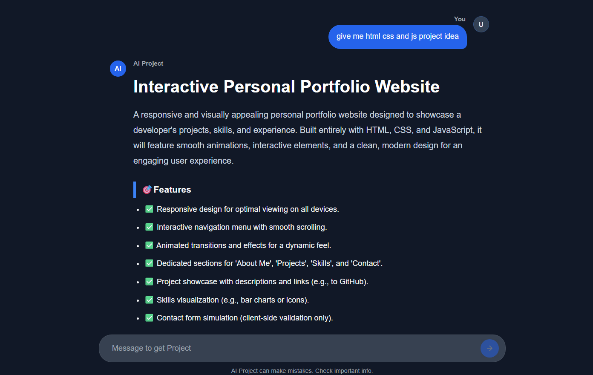

# AI Project Idea Generate.
An AI-powered web application that generates project ideas based on the user's selected technologies and skills.

## Description
An AI-powered project idea generator for web developers. Users select their frontend, backend, database, and other skills, then chat with AI to get project ideas based on their selected technologies. The AI provides practical project concepts, features, descriptions, and recommended technology stacks to help developers build projects that match their skills.

## 🛠️ Tech Stack

### Frontend
- **React** – UI library
- **React Router DOM** – Client-side routing

### Backend
- **Node.js**
- **Express.js** – Web framework
- **JWT (jsonwebtoken)** – Authentication & authorization
- **bcrypt** – Password hashing
- **cookie-parser** – Parsing cookies for session/auth handling
- **CORS** – Cross-Origin Resource Sharing
- **dotenv** – Environment variable management

### Database
- **MongoDB** – NoSQL database
- **Mongoose** – ODM for MongoDB

### AI Integration
- **Gemini AI** (`@google/genai`) – AI/LLM features

## ✨ Features
- Select frontend, backend, database, and other technologies
- Generate AI-powered project ideas
- Get project descriptions and key features
- View recommended technology stacks
- Chat-based project idea generation
- Save and manage previous conversations

## Folder Structure

```
Project Idea Ai/
├── backend/
│   └── src/
│       ├── config/
│       ├── controllers/
│       ├── db/
│       ├── middleware/
│       ├── models/
│       └── ...
├── frontend/
│   └── src/
│       ├── auth/
│       ├── Components/
│       ├── Context/
│       ├── hooks/
│       └── ...
├── README.md
```

## Screenshot


## Getting Started

### Run Locally
1. Clone the repository
   ```
   git clone https://github.com/harsh-coder-desgin/projectai
   ```

3. Install dependencies
   ```
   npm install
   ```

5. Start the development server
   ```
   npm run dev
   ```

## Future Work
- Improve AI responses based on user experience and interests.
- Add GitHub integration to track and analyze user projects.
- Add more technology and skill options.
- Add project difficulty levels such as Beginner,Intermediate and Advanced.
- Allow users to save and manage their favorite project ideas.
- Add the ability to export project ideas and details.

## Author
Harsh Patel  
LinkedIn: https://www.linkedin.com/in/harsh-patel-2b3405303


